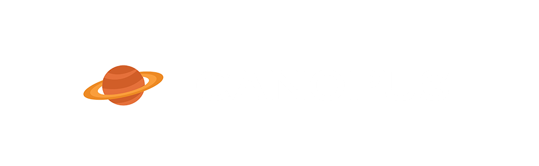

Samudera Angkasa

## Tentang Canopus

Canopus adalah perangkat lunak edukasi ilmu astronomi berbasis website yang dikembangkan eksklusif untuk masyarakat Indonesia. Canopus dibangun dengan tujuan untuk membantu masyarakat Indonesia dari semua kalangan mengenal, menumbuhkan minat, serta menumbuhkan rasa senang terhadap ilmu astronomi. Beberapa fitur yang terdapat dalam Canopus diantaranya adalah :

- Edukasi ilmu astronomi (planet dan benda langit lainnya).
- Membuat sekaligus mengelola akun.
- Membuat sekaligus mengelola topik diskusi.
- Mengelola konten edukasi ilmu astronomi dalam daftar favorit.
- Mengelola tanya jawab dengan pengguna lain.
- Mengevaluasi konten edukasi ilmu astronomi.

Canopus adalah perangkat lunak edukasi ilmu astronomi berbasis website yang ringan, menarik, dan informatif.

## Pengembangan

Dalam pengembangannya, Canopus menggunakan bahasa, perangkat lunak bantuan, serta framework berikut :

### Bahasa, Framework, Library
- **[PHP](https://php.net/)**
- **[Laravel](https://laravel.com/)**
- **[Laravel Jetstream](https://jetstream.laravel.com/2.x/introduction.html)**
- **[TailwindCSS](https://tailwindcss.com/)**
- **[TailwindUI Kit](https://tailwinduikit.com/)**
- **[Faker](https://fakerphp.github.io/)**

### Perangkat Lunak Bantuan
- **[Figma](https://figma.com/)**
- **[Visual Studio Code](https://code.visualstudio.com/)**
- **[ClickUp](https://clickup.com/)**
- **[Laragon](https://laragon.org/)**

## Kontributor

Berikut adalah kontributor - kontributor utama yang membantu pengembangan perangkat lunak Canopus :
- [Dafa Rizky Fahreza](https://github.com/dafalagi/)
- [Saeful Anwar Oktariansah](https://github.com/SaefulA0)
- [Ikhsan Nurul Rizki](https://github.com/IkhsanNurulRizki)
- [Muhammad Rojabi Nur Fauzi](https://github.com/FauziSS)
- [Arif Abdan Syakur](https://github.com/arifabdan)

## Masukan

If you discover a security vulnerability within Laravel, please send an e-mail to Taylor Otwell via [taylor@laravel.com](mailto:taylor@laravel.com). All security vulnerabilities will be promptly addressed.

## License

Canopus adalah perangkat lunak open-source yang dilisensikan dibawah [MIT license](https://opensource.org/licenses/MIT).
